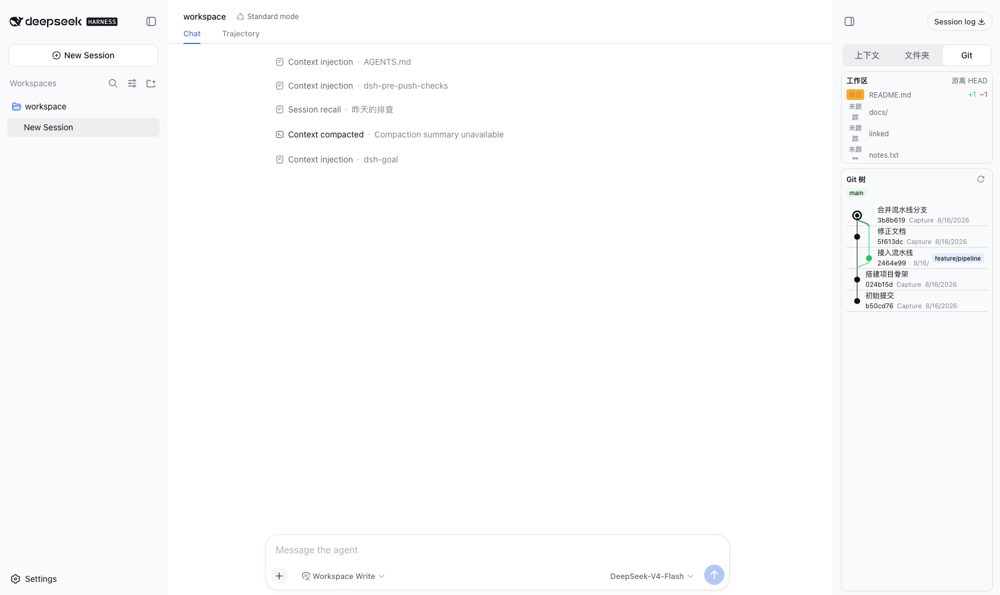
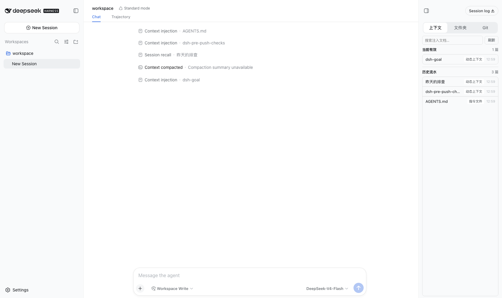
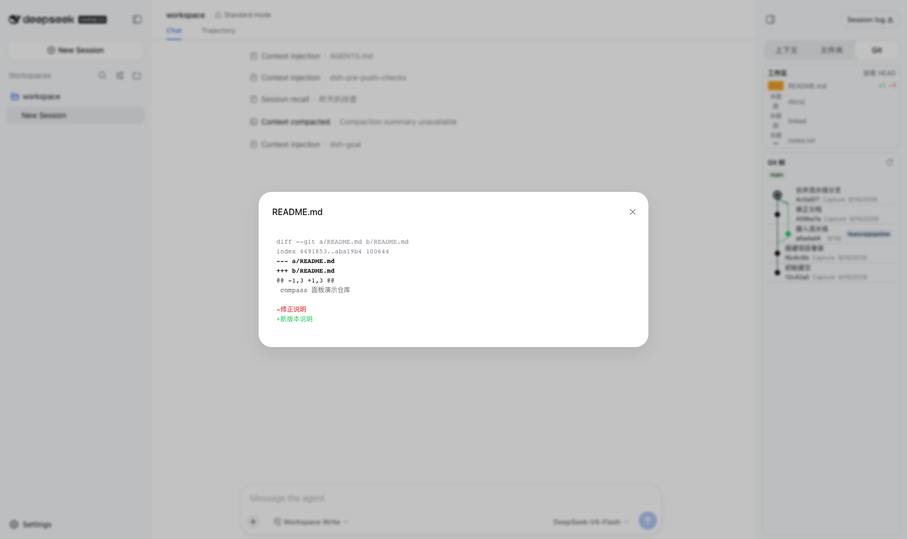
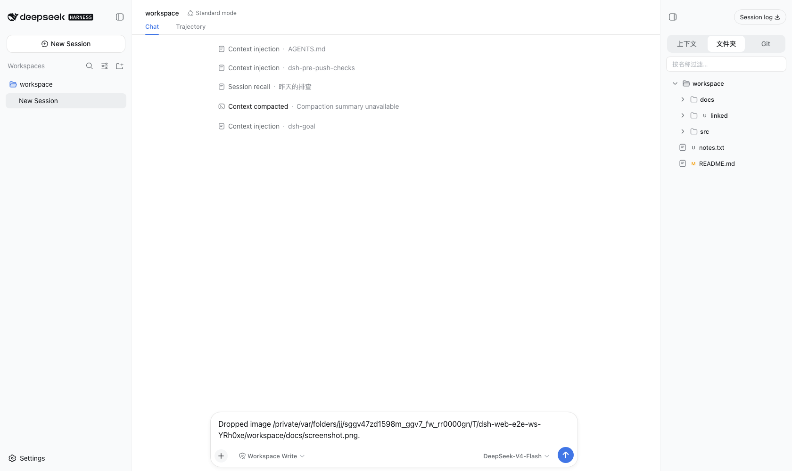

# DeepSeek Harness — 上下文面板分支

[English](README.md) | 中文

这是 [DeepSeek Harness](https://github.com/deepseek-ai/deepseek-harness) 的一个分支，新增了右侧上下文文件面板、面板文件拖入对话与对话避让。其余部分与上游保持一致。

## 本分支新增的功能

### 右侧上下文文件面板

一个常驻、可调宽的面板，固定在 Web 界面右缘，包含三个标签：

- **文件夹** — 浏览会话工作区目录：目录在前排序、按名称过滤、带 git 工作区状态徽章，每行可打开或复制路径。
- **上下文** — 从会话日志读取的注入上下文文档，分为当前有效窗口与压缩历史流水两部分，带搜索；视图随会话事件流实时重投影，会话激活时自动遍历历史（最多 1,000 条消息），两个区块无需手动翻页即持有完整日志。
- **Git** — 带边框的工作区区块（分支位置、未提交文件）加只读提交图（IDE 历史视图风格），带刷新按钮；展开提交查看变更文件，点击工作区行或提交内文件都在中部弹出 diff。Diff 预览按行角色着色（新增、删除、hunk 头）。







### 面板文件拖入对话

把面板里的文件行拖进对话区，携带的是文件的绝对路径。图片文件在支持图片的模型上会直接读取内容并附加进本条消息；其他模型（或读取失败）则收到路径说明，由 agent 用自己的工具处理。任何情况下都不在工作区复制文件。



### 文本文件拖放录入

把文本文件拖到页面上任意位置即可附加为文件芯片；提交时内容折入消息，绝不粘贴进文本框。

### 对话避让

对话区域为面板预留右侧空间，因此面板绝不会遮挡聊天内容。

## 运行

通过 npm（上游包）：

```sh
npx @deepseek-ai/dsh web
```

从源码运行：

```sh
git clone https://github.com/Happy2Git/deepseek-harness.git
cd deepseek-harness
pnpm install
pnpm run build
pnpm dsh web
```

Web 界面默认运行在 `http://127.0.0.1:3080`。

## 可独立发布的插件

面板及其 Git／目录后端已作为生态插件单独发布，见 [dsh-compass](https://github.com/Happy2Git/dsh-compass)。终端 TUI（`dsh-terminal`）以同样的方式打包，功能完善前暂不发布。

## 许可证

MIT。Copyright (c) 2026 DeepSeek。本分支保留上游 [LICENSE](LICENSE)。
